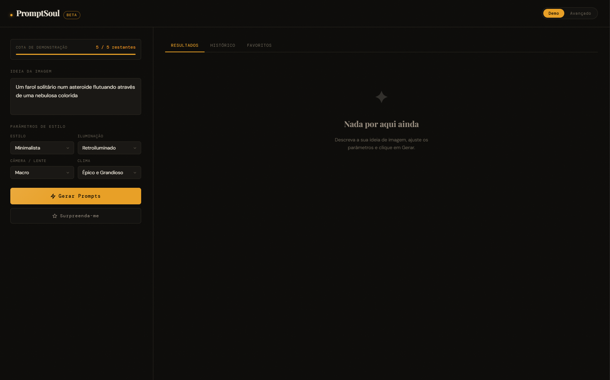

# ✦ PromptSoul
**Gerador de prompts para imagens com IA.** Descreva sua visão — receba 3 prompts profissionais, prontos para usar no Midjourney, DALL-E, Stable Diffusion e muito mais.

> 🔗 <strong><a href="https://pedrovitor-dev.github.io/prompt_soul/" target="_blank">Acessar o App →</a></strong>

---



---

## Funcionalidades

- **Geração com IA** — refina sua ideia em 3 variações ricas e detalhadas
- **Tradução automática** — escreva sua ideia em português e o PromptSoul traduz para inglês antes de gerar, garantindo prompts mais precisos e profissionais
- **Parâmetros de estilo** — escolha estilo artístico, iluminação, lente e atmosfera
- **Estilos cinematográficos** — cada geração sorteia automaticamente um estilo visual inspirado em estéticas do cinema (noir, sci-fi minimalista, simetria, realismo cinemático e mais)
- **Lentes técnicas** — cada variação inclui uma lente fotográfica específica (35mm, 85mm, teleobjetiva, grande angular e outras)
- **Surprise Me** — ideia aleatória + parâmetros instantâneos para inspiração criativa
- **Modo Básico** — gerações ilimitadas e gratuitas, sem cadastro, direto no navegador
- **Modo Avançado** — use sua própria key do OpenRouter para geração via IA real
- **Histórico** — últimas 30 gerações salvas automaticamente no seu navegador
- **Favoritos** — salve os prompts que você mais gostou com um clique no ♥
- **Copiar com um clique** — copie um prompt ou todos de uma vez
- **UI dark editorial** — minimalista, rápida e sem distrações

---

## Básico vs Avançado

| Funcionalidade | Modo Básico | Modo Avançado |
|---|---|---|
| API key necessária | Não | Sim (a sua própria) |
| Limite diário | Ilimitado | Ilimitado |
| Motor de geração | Local (offline) | OpenRouter (IA real) |
| Qualidade dos prompts | Alta | Muito alta |
| Configuração | Nenhuma | Cole a key no app |

---

## Como usar

### Opção A — Usar o demo online
Acesse **[[Este Link](https://pedrovitor-dev.github.io/prompt_soul/)]** e comece a gerar. Nenhuma conta necessária.

### Opção B — Rodar localmente
```bash
# 1. Clone o repositório
git clone https://github.com/seu-usuario/promptsoul.git
cd promptsoul

# 2. Abra no navegador
open index.html
# ou simplesmente arraste o index.html para o navegador
```
Sem etapa de build. Sem dependências. HTML/CSS/JS puro.

---

## Tecnologias

| Camada | Tecnologia |
|---|---|
| Frontend | HTML, CSS, JavaScript |
| Tradução | [MyMemory API](https://mymemory.translated.net) (gratuita, sem key) |
| API de IA | [OpenRouter](https://openrouter.ai) (modo Avançado) |
| Modelo padrão | Mistral 7B Instruct (ou qualquer outro que escolher inclusive gratuito) |
| Armazenamento | localStorage (navegador) |
| Deploy | Vercel |

---

## Como funciona

1. O usuário descreve uma ideia em português e escolhe parâmetros de estilo opcionais
2. O PromptSoul traduz automaticamente a ideia para inglês via MyMemory API
3. **Modo Básico:** a geração acontece localmente, combinando modificadores de qualidade, render, atmosfera, lentes técnicas e estilos cinematográficos em 3 variações únicas
4. **Modo Avançado:** a ideia + parâmetros são enviados ao OpenRouter com um system prompt cuidadosamente elaborado, e o modelo retorna 3 variações distintas
5. Os resultados são exibidos, salvos no histórico e prontos para copiar

**O histórico e os favoritos** são salvos inteiramente no navegador via `localStorage`. Nenhum backend ou banco de dados necessário.

---

## Estilos Cinematográficos

O PromptSoul inclui 7 estilos visuais inspirados em estéticas cinematográficas, sorteados automaticamente a cada geração — sem citar nomes de diretores para evitar problemas de direitos autorais:

| Estética |
|---|
| Realismo cinemático, iluminação natural, escala épica |
| Paleta ousada, enquadramento dramático, estética grindhouse |
| Simetria perfeita, paleta pastel, composição flat |
| Sci-fi minimalista, iluminação atmosférica, ambientes de grande escala |
| Noir futurista, iluminação cyberpunk, névoa volumétrica |
| Iluminação cinemática emocional, luz quente, profundidade narrativa |
| Simetria fria, ambiente estéril, enquadramento preciso |

---

## Licença

MIT — faça o que quiser com o código.

---

<p align="center">Desenvolvido por PedroVitor-Dev 🧙</p>
